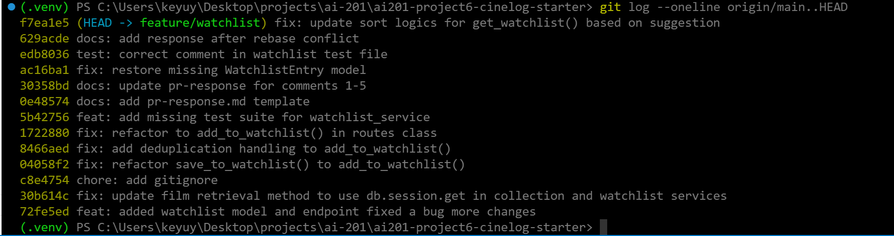

# PR Response Doc — CineLog Watchlist Feature

## AI Usage
<!-- Fill in at the end — how you used AI tools during this project -->

## Comment 1 — Rename
**What I did:** use the find all references feature on VSCode to identify all usages/calls to `save_to_watchlist()` and rename each references.
**How I verified:** after all refactoring, I did a global search on `save_to_watchlist` and ensure that there is no match in this repo.

## Comment 2 — Deduplication
**What I did:** add an additional query/check on the user's WatchlistEntry. If a valid data returns from the query, then this means the user has already added the same file to Watchlist, so throw an `AlreadyInWatchlistError` (newly added Exception to surface this type of error).
**How I verified:** add an unit test in the test suite to ensure the same file cannot be added to the same watchlist and the expected error is thrown.

## Comment 3 — Missing test
**What I did:** Confirm test for watchlist_service is missing in the test suite entirely, added a test class for `watchlist_service` and added the missing test case for film not found.
**How I verified:** ran the entire test suite using `pytest /tests -v` to ensure all tests are passing and there is an entry for the newly added test.

## Comment 4 — Default visibility
**My position:** Default to `public=True`
**Reasoning:** this enables public view of user's watchlist, which offer a few benefits:
1. increasing user-to-user connection/engagement via shared films in the watchlist
2. targeted marketing on specific films
3. increase user's interest on a film after knowing number of other user's having a similar interests
**Tradeoff acknowledged:** Exposal of user's film preferences and privacy, and platform targeted marketing might be aggressive for users and cause negative reactions among users.

## Comment 5 — Sort order
**My position:** Sort based on added timestamp in descending order.
**Reasoning:** The latest added films are the closest representation of user's interest and film preferences, and they will most likely want to watch those films.
**Engagement with reviewer's point:** Agree with this suggestion. If sorted by title, then this mixed various added films. By argument, user's taste might have changed since they added the first few films to the watchlist. Sorting by title will bring visibility to those older films in the list, but they might no longer be of interest to the user while increasing friction point for user to select a film of interest to start playing. 

## Comment 6 — Rebase
**What conflicted:** `.gitignore` appeared as the only conflict. The difference between local and remote main was `pytest_cache` and 2 packages (`venv` and `.venv/`).
**How I resolved it:** Keep the current version since my branch has all the contents as the remote, plus the `pytest_cache` which was applicable due to tests. 
**How I verified no conflict remains:** Able to run the `git add .gitignore` and `git rebase --continue` successfully after resolving conflicts. Then, I ran the entire test suite with `pytest /tests -v` to ensure all tests should be passing as before. However, tests with `WatchlistEntry` references started to break, since the remote main doesn't have this model added. To resolve the test failures, I have bought back the `WatchlistEntry` class and all tests are currently passing as before.

## PR Description
<!-- Written at the end — feature overview, design decisions, manual testing steps -->